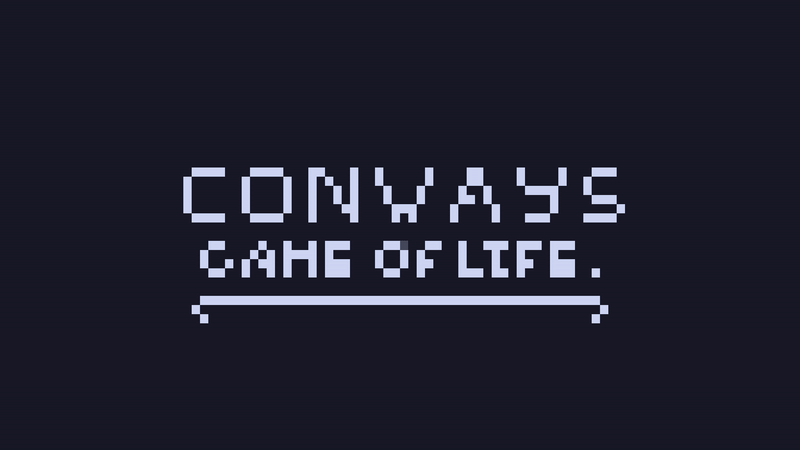

# Conways Game Of Life (In The ~~Flesh~~ Terminal)

Single file, C++ terminal Conway's Game Of Life
I tried making this without using AI in any form but I got stuck in a couple spots while debugging, those were the only times I used it.
I also didn't use any libraries like ncurses which is why the UI ~~IS FREAKING HORRIBLE~~ seems uninspired.. in case.. you were.. wondering......

## Controls

* `h,j,k,l` or `w,a,s,d` to move camera around
* `space` to activate/deactivate a tile
* `enter` to play/pause
* `q` to quit 

## Building From Source

insert intense building from source code block here

## To-do

- [x] Update when window is resized
- [ ] Windows support
- [ ] Ability to save and load
- [ ] Optimizing (it's really REALLY slow for large maps)
- [ ] Infinite Tiling??
